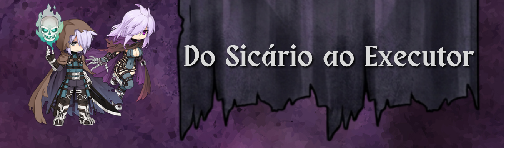

<p align="center">
  
  <a href="https://www.youtube.com/@igantee">@igantee</a>
  &nbsp;|&nbsp;
    
  <span>@igorWL</span>
</p>

## Introdução

Neste guia eu vou abordar apenas a build de Katar, porque na MINHA opinião, embora a build de Adagas tenha um teto maior de dano, ela acaba sendo muito custosa. Não acho que vale a pena usar adagas se você não aproveitar os vários slots de carta pra situações específicas. Pra usar apenas adagas genéricas, eu prefiro Katar, já que vai ser mais barato e vai exigir menos sacrifícios pra fechar a build e a taxa crítica.

### Resumo da build

| Ponto | Direção |
| --- | --- |
| Arma principal | Katar |
| Foco | Crítico, dano crítico, dano corpo a corpo, dano por tamanho, dano em raça/normal/chefe, Pós-conjuração e ASPD |
| Conteúdo-alvo | Up solo, farm de instâncias e progressão até início do end-game |
| Gargalos principais | Taxa Crítica, bypass/ignorar DEF, penalidade de arma e pós-conjuração |
| Última atualização | 28/06/2026 |

### Prioridades

1. Fechar CRIT suficiente pro conteúdo que você quer fazer.
2. Garantir bypass/ignorar DEF quando o dano começar a travar.
3. Anular ou compensar a penalidade de arma da Katar.
4. Fechar 30% de pós-conjuração.
5. Resolver sustain pra farm e up solo.
6. Dano crítico, dano físico, P.ATQ, dano corpo a corpo e afins.
7. Fechar ASPD ou no ponto confortável pra você.

### Erros comuns

- Focar em dano antes de fechar o CRIT.
- Esquecer bypass/ignorar DEF contra monstros normais e chefe.
- Ignorar a penalidade de arma.
- Focar em apenas um único multiplicador de dano.
- Usar carta de tamanho/raça errada pra instância.

## Skills

### Gatuno

A árvore de Gatuno é bem simples e não tem muito o que pensar. Eu prefiro deixar o Furto no lv10 porque além de útil, não vejo muito sentido em ter Esconderijo maximizado.

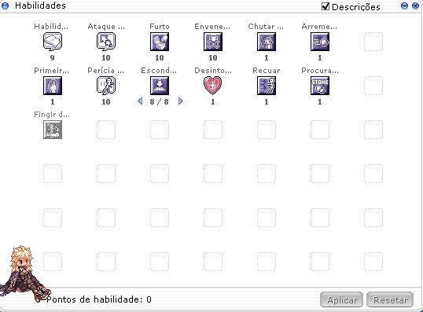

### Algoz

A árvore de skills do Algoz também é bem simples. Seu foco tem que ser pegar os pré-requisitos da classe Sicário e a skill que faz o Algoz/Sicário/Executor ser o que é: Encantar com Veneno Mortal.
Eu particularmente gosto de colocar Destruidor de Almas no 10 pra tirar proveito da Pedra de Algoz II, que será citada mais à frente, e das skills que as pedras de visual Algoz e Algoz II pedem. Depois disso, entre colocar o resto dos pontos em Impacto Meteoro ou maximizar Envenenar Arma, eu recomendo a segunda opção.

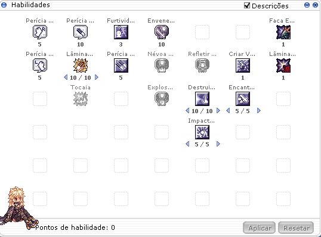


### Sicário

No Sicário, a build começa a tomar forma. As skills de dano físico giram em torno de Lâminas Retalhadoras, Lâminas de Loki ou Retaliação, dependendo da arma e dos equips. É de suma importância maximizar Pesquisa de Toxinas pra aumentar a duração da nossa EDP. Aplicar toxina também vai ser MUITO importante, tanto pra upar com Cicuta quanto pra aumentar o dano com Pirexia e ela sempre vai ser aplicada em você mesmo. Garra Sombria vai fazer você ter ainda mais dano explosivo. Eu não vejo muito motivo, HOJE, pra gastar mais que 2 pontos em Castigo de Loki.

Sobre o [Aplicar Toxina](https://browiki.org/wiki/Aplicar_Toxina), exitem diversas toxinas mas as 3 principais são: Cicuta, Pirexia e Waraitake 

	Cicuta - Regenera 1% de SP por segundo. É a toxina que você vai usar 99% do tempo.
	Pirexia - Dano crítico +15%. Dano de ataque básico +(Nv. de base ÷ 20)%. Geralmente usada para matar MVPs ou Boss de Instância.
	Waraitake - Pós-conjuração -10%. Um pouco mais situacional, principalmente quando você ainda não fechou a pós-conjuração.

Obs.: Quando você aplica a toxina, voocê ganha um bônus de 10% de dano corpo a corpo.


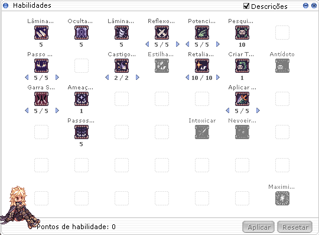

### Executor

No Executor, as coisas começam a mudar bastante. Além de você começar a pegar pontos de POD e CRV, que vão alavancar muito seu dano, existem 2 skills que eu considero as mais importantes: Senso das Sombras e Adulterar Veneno. Senso das Sombras vai te dar CRIT pra ajudar a fechar a build e aumentar o leque de opções de equips. Como você ganha 25 de CRIT no nv. 10, não precisa ficar preso a certos equips só porque eles fecham sua taxa crítica. A outra skill que considero muito importante é Adulterar Veneno, porque ela te dá 20% de bypass/ignorar Tenacidade dos monstros, que é a nova DEF dos monstros 200+. Nesse momento, você vai precisar escolher entre maximizar Senso das Sombras*, aumentar Impacto Brutal** ou investir na ULT, Carrasco Sombrio***.

*Eu particularmente gosto dela no nv. 10 pra me dar liberdade de usar equips que não deem taxa crítica.

**Hoje eu acho que essa skill não está legal. Ela tem uma área de 3x3, tem 1s de recarga e o dano sem a ULT é inferior ao de Retalhadoras, além de não recuperar AP. No futuro, ela vai aumentar a área, primeiro pra 5x5 e depois pra 7x7, e começar a recuperar 2 de AP por uso. Eu deixei no 10 visando o futuro.

***Como o único jeito de recuperar AP hoje pra build de Katar é com Impacto Cratera, que tem 5s de recarga, não é viável usar Carrasco Sombrio pra farmar ou upar com Impacto Brutal. Eu deixei no 1 pra usar com Talho Eterno, que hoje é a skill com maior potencial de dano do Executor. Pra mim, 60s é o suficiente pra estar ultado, mas sinta-se livre pra aumentar os pontos aqui.

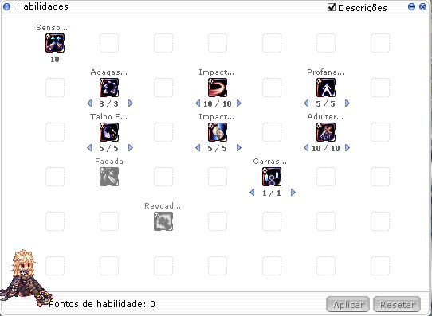

## Atributos

### Visão Geral

Atributos devem acompanhar os bônus dos equips. Pra Katar crítico, FOR, AGI e SOR são os pilares mais comuns, mas VIT e DES continuam importantes pra conforto, sobrevivência e acerto quando necessário.

| Atributo | Função na build |
| --- | --- |
| FOR | ATQ, dano físico e ativa bônus com Cachecol Físico de Schmidt + Brasão FOR e Carta Tritão Abismal |
| AGI | ASPD e Esquiva |
| VIT | HP, sobrevivência pra farm/instâncias e anti-status |
| INT | Baixa prioridade; ajuste apenas se SP virar problema |
| DES | Precisão e conforto geral, especialmente com skills que não se baseiam no CRIT |
| SOR | CRIT, dano crítico indireto por equips, bônus com Cachecol Físico de Schmidt + Brasão SOR e anti-status |

### Stats importantes pra entender

Alguns nomes parecem parecidos, mas não fazem a mesma coisa. Essa confusão é bem comum e pode fazer você comprar item errado.

| Stat | O que faz | Como pensar na build |
| --- | --- | --- |
| Esquiva | Como o nome diz, é a chance de esquivar de um ataque, mas não ache que você é um Deus e nada vai te acertar porque sempre que você é atacado por mais de 2 monstros, sua esquiva cai em 10% por monstro extra | Pra Katar, a chance crítica real é dobrada, mas isso não aparece na janela de atributos. Então o número exibido não conta a história inteira. |
| CRIT | É a chance de acertar crítico. Crítico ignora Esquiva, mas não ignora Esquiva Perfeita nem DEF. | Pra Katar, a chance crítica real é dobrada, mas isso não aparece na janela de atributos. Então o número exibido não conta a história inteira. |
| Dano crítico % | Multiplicador aplicado no dano crítico depois da base de crítico. | Muito bom, mas também pode saturar. Compare com dano contra tamanho, raça, chefe, propriedade e dano físico. |
| POD | Atributo de 4ª classe focado em dano físico. Cada ponto dá ATQ e, a cada 3 pontos, dá P.ATQ. | Aumenta consideravelmente o dano do seu Executor, principalmente por causa do P.ATQ. |
| CRV | A cada 3 pontos, dá 1 de T.CRIT. | Interessa principalmente pelo T.CRIT. Ele não aumenta sua chance de crítico; ele aumenta o dano do crítico. |
| P.ATQ | Afeta diretamente o dano físico causado. | Atua como um multiplicador final de dano. |
| T.CRIT | Aumenta o dano crítico base. O crítico começa em 140% e cada ponto de T.CRIT adiciona 1% nesse dano base. | Não confunda com chance de crítico. CRIT ajuda a critar enquanto o T.CRIT faz o crítico bater mais. |

O CRIT mostrado no Alt+A não é exatamente a sua chance final de crítico contra monstros. O alvo reduz sua chance de crítico com uma mecânica chamada `Critical Hit Shield`. Ela funciona como uma "defesa contra crítico" do monstro:

```text
Critical Hit Shield = (Nível base do monstro ÷ 15) + (LUK do monstro ÷ 5)
```

Então a sua taxa crítica real fica mais ou menos assim:

```text
Sua taxa CRIT - Critical Hit Shield do monstro
```

Exemplo: Kiel-D-01 é nível 125 e tem 180 de LUK. O Critical Hit Shield dele é `(125 ÷ 15) + (180 ÷ 5)`, ou seja, `8 + 36 = 44`. Se você tiver 96 de CRIT, sua chance de crítico contra ele fica em torno de `96 - 44 = 52%`.

Por isso, "100 de CRIT no Alt+A" nem sempre significa "100% de crítico". Contra monstros de nível alto, com muita LUK ou contra MVPs específicos, você precisa de uma margem maior.

Pra Katar, existe uma vantagem enorme: a chance crítica real é dobrada quando você usa esse tipo de arma. Só que o jogo não mostra essa dobra na janela de atributos. É por isso que Katar consegue fechar crítico com mais facilidade que outras armas.

Referência de mecânica: [iRO Wiki - Stats](https://irowiki.org/wiki/Stats).

### Progressão

Tente fechar o CRIT o quanto antes se quiser upar nas Retalhadoras. Caso opte por upar com Loki ou Retaliação, DES vai ser bem-vinda. Pra farm de instâncias, principalmente, a taxa CRIT obrigatoriamente tem que estar alta; caso contrário, o DPS pode cair muito se as Retalhadoras não critarem.

### Sugestão

| Atributo | Range |
| --- | --- |
| FOR | 120 ~ 125|
| AGI | 90 ~ 100 |
| VIT | 90 ~ 110 |
| INT | O que sobrar |
| DES | 50 ~ 70 |
| SOR | 120 ~ 125|

## Como Pensar a Build

Antes de olhar uma tabela e copiar item por item, tente entender qual problema sua build precisa resolver. Sicário fica muito melhor quando você compra pensando em gargalo: CRIT, ASPD, pós-conjuração, bypass, penalidade de arma, sustain ou multiplicador de dano.

### Saturação de Multiplicador

Essa seção é uma simplificação pra te ajudar a pensar antes de comprar equips. A fórmula real do Ragnarok tem várias etapas, grupos de bônus e arredondamentos, mas a ideia mais importante é: bônus do mesmo tipo geralmente somam entre si, enquanto bônus de tipos diferentes costumam se multiplicar.

Imagine que sua build tenha cinco multiplicadores diferentes: A, B, C, D e E.

Se todos estão em +10%, o cálculo ficaria assim:

```text
1,10 × 1,10 × 1,10 × 1,10 × 1,10 = 1,61
```

Agora imagine que você tem mais 40% de bônus pra distribuir.

Se colocar tudo no multiplicador B, ele vai de +10% pra +50%:

```text
1,10 × 1,50 × 1,10 × 1,10 × 1,10 = 2,19
```

Mas se dividir esses 40% entre A e B, deixando os dois em +30%:

```text
1,30 × 1,30 × 1,10 × 1,10 × 1,10 = 2,25
```

Os dois jeitos vão aumentar o dano, mas dividir entre multiplicadores diferentes gera um resultado melhor.

É isso que chamamos de saturação de multiplicador. Não é que aquele bônus parou de funcionar; ele ainda aumenta o dano. O problema é que ele está disputando espaço com outros multiplicadores que podem render mais na build.

### Dano de skill

O mesmo raciocínio vale pra bônus de dano de skill, como "aumenta o dano de Lâminas Retalhadoras em X%".

Por exemplo,  [Carta Alma de Eremes](https://www.divine-pride.net/database/item/4684/carta-alma-de-eremes),  [Memorável Vingança dos Mortos](https://www.divine-pride.net/database/item/18982/memoravel-vinganca-dos-mortos-1),  [H-Lâminas](https://www.divine-pride.net/database/item/310139/h-laminas) e  [Orbe Lupino - Lâminas](https://www.divine-pride.net/database/item/310528/) podem acumular muita % e acabar "saturando" o multiplicador.

A lógica é a mesma que foi explicada acima. Quanto mais você já tem do mesmo bônus, menor fica o ganho real ao adicionar mais um pouco.

Uma forma simples de pensar:

- Se você tem 0% de dano de skill, ganhar +20% vira 1,00 -> 1,20. Isso é 20% de ganho real.
- Se você já tem +100% de dano de skill, ganhar +20% vira 2,00 -> 2,20. Isso é 10% de ganho real.
- Se você já tem +200% de dano de skill, ganhar +20% vira 3,00 -> 3,20. Isso é cerca de 6,7% de ganho real.

Então, dano de skill vale muito a pena quando:

- a build realmente gira em torno da skill;
- você ainda tem pouco bônus específico daquela skill;
- o item também traz outros stats úteis;
- seus gargalos básicos já estão resolvidos.

Começa a valer menos quando:

- você já acumulou muito dano daquela mesma skill;
- o item sacrifica outro multiplicador importante;
- outro upgrade daria dano contra tamanho, chefe, raça, propriedade, dano crítico, ATQ%, P.ATK ou dano físico corpo a corpo que sua build ainda tem pouco.

Por isso, a Carta Alma de Eremes pode ser muito boa pra build focada em Lâminas Retalhadoras, principalmente em arma nível 4 e refino +10. Mas se você já usa Memorável Vingança dos Mortos, H-Lâminas ou Orbe Lupino - Lâminas, talvez outra como a Andarilho Poluto passe a render mais por ser um multiplicador diferente.

A regra é simples: veja qual multiplicador o item aumenta e compare com o que sua build já tem. O dano cresce melhor quando todo mundo sobe junto, e não quando um único camarada fica com todo o protagonismo. [Clique aqui](https://youtu.be/qigIYJWsyWE?si=EcYcGr-94t1WbB5F&t=6)

### Como Identificar Gargalos

Use essa tabela quando o personagem "parece ruim", mas você ainda não sabe exatamente por quê. Antes de comprar mais dano, tente descobrir qual parte da build está segurando o resultado.

| Sintoma | Possível problema | Antes de comprar |
| --- | --- | --- |
| Retalhadoras falha ou não crita sempre | CRIT baixo pro alvo | Confira SOR, resistência a crítico do alvo, cartas, consumíveis, shadows críticos e bônus temporários. |
| O dano fica bom no boneco, mas ruim em instância | Carta ou multiplicador errado pro alvo | Veja tamanho, raça, propriedade e se o alvo é normal, chefe ou MVP. |
| O dano parece travar contra monstros com muita DEF | Falta de bypass/ignorar DEF | Revise Sombrio Inicial, Combo do Katar/Sicário, Combo Penetrante e outras fontes de bypass. |
| Mata forte, mas mata devagar | ASPD ou pós-conjuração insuficiente | Confira 193 ASPD, delay das skills e se você fechou a pós necessária. |
| O dano muda muito de um alvo pra outro | Penalidade de arma da Katar | Veja Cachecol + Brasão FOR, Manopla/Brinco Infinito ou outras formas de anular penalidade. |
| Morre ou gasta consumível demais | Sustain, HP ou resistência baixos | Resolva conforto antes de comprar dano. Farm morto não dá zeny. |
| Todo upgrade parece caro e pequeno | Multiplicador saturado | Procure outro grupo de bônus que esteja baixo na build. |
| DPS parece baixo mesmo com dano alto | Falta Pós-conjuração | Retalhadoras tem 0.5s de pós-conjuração e 0.35s de recarga então com 30% de pós você deixa sua Retalhadoras com 0.35s de pós-conjuração |

### Como Escolher o Próximo Upgrade

Antes de gastar seus suados KKs, responda:

1. Esse item resolve qual problema da minha build?
2. Ele aumenta um multiplicador que eu tenho pouco ou só acumula mais do mesmo?
3. A troca mantém CRIT, ASPD, pós-conjuração, bypass e penalidade de arma?
4. O item funciona sozinho ou depende de refino, grau, carta, combo ou encantamento caro?
5. Existe uma opção mais barata que resolve o mesmo gargalo?
6. Esse upgrade melhora o conteúdo que eu realmente faço ou só fica bonito no papel?

Se você não consegue responder essas perguntas, provavelmente ainda não é hora de comprar. Volte pra tabela de gargalos e estude mais XD (pode me mandar mensagem no Discord também)

## Equips

### Visão Geral

Nessa seção, a ideia é explicar por que usar cada peça, não apenas listar as opções. Pense nos equips como respostas pra problemas:

<b>Exemplos</b>: 

| Problema | Exemplos de solução |
| --- | --- |
| Sustain | Chapéu de Rideword, Katar de Cinzas, Chapéu Carnavalesco |
| Fechar CRIT | Orelhas/Máscara de Fafnir, Luva de Sorte, Gélida Ilusional no +11, Shadows Críticos, S-CRIT, Manto Temporal SOR |
| Fechar ASPD | Elmo Mortal de Cinzas, Colete/Motor Ilusión, Anti-Atraso, S-Rapidez, Asas/visuais conforme necessidade |
| Reduzir pós | Elmo Mortal de Cinzas +11, Alicate +11, Escudo Sombrio da Recarga, Mega Repente, visuais Sicário II |
| Ignorar DEF | Sombrio Inicial, Combo do Katar/Sicário, Combo Penetrante |
| Penalidade de arma | Cachecol Físico de Schmidt + Brasão FOR, Manopla/Brinco Sombrio Infinito |
| Dano genérico | Dano físico, dano corpo a corpo, dano crítico, dano contra todos os tamanhos |

### Topo

Opções de Topo:

| Item | Quando usar | Por quê |
| --- | --- | --- |
|  [Ferramentas Agrícolas](https://www.divine-pride.net/database/item/401250/ferramentas-agricolas-1)| Início | Regenera HP/SP ao derrotar monstros. Troque quando sustain começar a desejar. |
|  [Chapéu de Rideword [1]](https://www.divine-pride.net/database/item/5208/chapeu-de-rideword-1) | Início/farm | Sustain por conversão de dano físico em HP/SP. Troque quando sustain deixar de ser gargalo. |
|  [Chapéu Carnavalesco [1]](https://www.divine-pride.net/database/item/401205/chapeu-carnavalesco-1) | Início e up | Regenera HP/SP ao derrotar monstros, escala ATQ por nível e dá dano corpo a corpo. |
|  [Elmo Mortal de Cinzas [1]](https://www.divine-pride.net/database/item/401251/elmo-mortal-de-cinzas-1) | Early/mid | Entrega Dano físico, ASPD e pós no +11. Com Katar de Cinzas adiciona dano corpo a corpo e dano de skills. |
|  [Espólio de Eremes [1]](https://www.divine-pride.net/database/item/400121/espolio-de-eremes-1) | Mid-game | Escala ATQ, ASPD e dano contra todos os tamanhos no +11. Muito bom com Agudo Filo. |
|  [Memorável Vingança dos Mortos [1]](https://www.divine-pride.net/database/item/18982/memoravel-vinganca-dos-mortos-1) | Mid/end | Dano crítico e ASPD por refino, além de bônus pra Castigo de Loki e Lâminas Retalhadoras. |


### Meio

Opções de Meio:
LEMBRE-SE: não é possível remover carta de equips de meio.

| Item | Quando usar | Por quê |
| --- | --- | --- |
|  [Orelhas de Fafnir](https://www.divine-pride.net/database/item/18559/orelhas-de-fafnir) | Início | CRIT simples e barato; com Máscara de Fafnir adiciona dano crítico. |
|  [Selo de Loki [1]](https://www.divine-pride.net/database/item/410233/selo-de-loki-1) | Mid/End-game | Fica muito forte com Selo de Copas no baixo, dando Dano físico e dano corpo a corpo além dos encantamentos |
|  [Asas Vitoriosas [1]](https://www.divine-pride.net/database/item/400002/asas-vitoriosas-1) | Situacional | Ajuda a pegar pós-conjuração e manter slot. |
|  [Chip de Batalha [1]](https://www.divine-pride.net/database/item/410017/chip-de-batalha-1) | Situacional | ATQ/ATQM simples e encantamentos de % de dano corpo a corpo. |
|  [Óculos de Segurança [1]](https://www.divine-pride.net/database/item/410614/oculos-de-seguranca-1) | Com armas de Einbech | Bom com Alicate. Te ajuda muito a não morrer. |
|  [Diadema Radiante [1]](https://www.divine-pride.net/database/item/410183/diadema-radiante-1) | Situacional/End-game | Use SOMENTE com Anel/Colar Radiante Rubi/Aquamarina: Dano físico, ASPD, pós e dano contra Chefes, dano contra Demônios e Anjos. |
|  [Fones Amplificadores [1]](https://www.divine-pride.net/database/item/19241/fones-amplificadores-1) <br>  [Fones Danificados [1]](https://www.divine-pride.net/database/item/19245/fones-danificados-1) | Suporte pra carta | São basicamente como meios com slot. Podem receber alguns encantamentos mas não que vá realmente mudar sua vida|

### Baixo

Opções de Baixo:

| Item | Quando usar | Por quê |
| --- | --- | --- |
|  [Máscara de Fafnir](https://www.divine-pride.net/database/item/18560/mascara-de-fafnir) | Início | CRIT simples e combo barato com Orelhas de Fafnir. |
|  [Competidor Lunático](https://www.divine-pride.net/database/item/420822/competidor-lunatico) | Early/Mid-game | Pós-conjuração e dano corpo a corpo. Ótimo baixo barato. |
|  [Selo de Copas](https://www.divine-pride.net/database/item/420210/selo-de-copas) | Mid/End-game | Com Selo de Loki, dá Dano físico e dano físico corpo a corpo. |
|  [Cachecol Físico de Schmidt](https://www.divine-pride.net/database/item/420748/cachecol-fisico-de-schmidt) | Mid/End-game | Com Brasão de FOR e FOR no 125, anula penalidade da arma. Com Brasão SOR e SOR 125, dá ATQ flat e dano corpo a corpo. |
|  [Balão da Família Poring](https://www.divine-pride.net/database/item/19095/baloes-da-familia-poring) | Situacional | Use se estiver upando, farmando e não precisar fechar um gargalo. |
|  [Familiar de Combate](https://www.divine-pride.net/database/item/19101/familiar-de-combate) | Situacional | Use se resolverem um gargalo específico ou estiverem muito baratos no mercado. |

### Armaduras

| Item | Quando usar | Por quê |
| --- | --- | --- |
| [Nobre/Ilustre/Grácil](https://browiki.org/wiki/Equipamentos_de_Honra) | Início/F2P | Opção que o jogo te dá ao completar as quests dos Episódios 16.1, 16.2 e 17.1. Eu particularmente não acho interessante, já que o combo não dá taxa crítica, mas pode ser uma opção pra upar com Loki ou quebrar o galho. |
|  [Vestimenta dos Manuks [1]](https://www.divine-pride.net/database/item/15038/vestimenta-dos-manuks-1) | Início/F2P | Peça do combo Manuk e, na minha opinião, a melhor armadura pra quem está começando. Tem baixo custo e ajuda a fechar o CRIT com os encantamentos de CRIT.<br> [Lista de Encantamentos](https://browiki.org/wiki/Encantamentos_de_Mora) |
|  [Colete Ilusión A [1]](https://www.divine-pride.net/database/item/15376/colete-ilusion-a-1) | Mid-game | ATQ alto, ASPD no +7 e ótima sinergia com Motor Ilusión A e módulos. Vai te levar pra muito longe no jogo. Eu só troquei a minha quando mudei pro combo de Jetpack. |
|  [Colete Automatron A [1]](https://www.divine-pride.net/database/item/450127/colete-automatron-a-1) | End-game inicial | Upgrade natural do Ilusión A: mais ATQ base, mais ASPD e automódulos. |
|  [Traje do Lobo Cinzento [1]](https://www.divine-pride.net/database/item/450177/traje-do-lobo-cinzento-1) | End-game inicial | Compare com a Automatron e escolha pelo custo e/ou encantamento disponível. <br>[Encantamentos disponíveis](https://browiki.org/wiki/Equipamentos_Cinzentos)|
|  [Exoesqueleto FOR](https://www.divine-pride.net/database/item/450405/exoesqueleto-fisico-1)<br> [Exoesqueleto CRIT](https://www.divine-pride.net/database/item/450407/exoesqueleto-critico-1) | End-game | Uma das melhores armaduras do jogo em conjunto com o Jetpack. Combo muito caro. |
|  [Batina Angelical SOR](https://www.divine-pride.net/database/item/15397/batina-angelical-for-1) ou  [LUK](https://www.divine-pride.net/database/item/15402/batina-angelical-sor-1) | Alternativa | Faz sentido se entrar no combo Radiante/Angelical, o preço estiver bom e tiver um encantamento bom |


### Armas

| Item | Quando usar | Por quê |
| --- | --- | --- |
|  [Katar de Cinzas [1]](https://www.divine-pride.net/database/item/28000/katar-de-cinzas-1) | Early/sustain | Conversão de dano físico em HP/SP e combo com Elmo Mortal de Cinzas. |
|  [Infiltrador Ilusional [2]](https://www.divine-pride.net/database/item/28022/infiltrador-ilusional-2) | Early/Mid | Boa katar de transição principalmente contra Humanoides. Com Anel Ilusional ganha ASPD e dano crítico. |
|  [Gélida Ilusional [2]](https://www.divine-pride.net/database/item/610012/gelida-ilusional-2) | Early/Mid | Uma katar muito boa no geral. No +11 dá CRIT e melhora com Anel Ilusional. |
|  [Katar do Sicário [1]](https://www.divine-pride.net/database/item/1291/katar-do-sicario-1) | Early/Mid | Aumenta o dano da Retalhadoras e contra Humanoides. Versão melhorada da Infiltrador Ilusional mas com apenas 1 slot |
|  [Agudo Filo [2]](https://www.divine-pride.net/database/item/28044/agudo-filo-2) | Mid/End com Espólio | Dano crítico, dano contra todos os tamanhos no +9 e ótima sinergia com Espólio de Eremes. |
|  [Alicate [2]](https://www.divine-pride.net/database/item/28045/alicate-2) | Einbech/Lâminas de Loki | Dano físico, ASPD, pós no +11 e efeito de dano contra todos os tamanhos. |
|  [Katar Primordial [2]](https://www.divine-pride.net/database/item/610008/katar-primordial-2) | End-game | Excelente pra dano crítico e Lâminas Retalhadoras; no +11 dá CRIT e reduz recarga de Garra Sombria. |
|  [Katar Primordial-LT](https://www.divine-pride.net/database/item/610033/katar-primordial-lt-2) | High-Endgame | Evolução da Katar Primordial mas agora com o combo do Cordão do Executor, ela aumenta o dano do Impacto Brutal. Quanto mais Grau tiver, melhor (e mais caro) |
|  [Jur Primordial [2]](https://www.divine-pride.net/database/item/610009/jur-primordial-2) | Alternativa End-game | Katar mais "genérica" que a Katar Primordial. Tem bônus pra Lâminas de Loki, pós-conjuração no +9 e dano corpo a corpo no +11. |
|  [Jur Primordial-LT](https://www.divine-pride.net/database/item/610034/jur-primordial-lt-2) | High-Endgame | Evolução da Jur Primordial mas agora com o combo do Cordão do Executor, ela aumenta o dano do Talho Eterno. Quanto mais Grau tiver, melhor (e mais caro)|
|  [Katar de Cinzas-AD [2]](https://www.divine-pride.net/database/item/610019/katar-de-cinzas-ad-2)| Alternativa High-Endgame | Evolução da Katar de Cinzas, ela aumenta o dano do Impacto Cratera conforme o Grau|

### Capa


| Item | Quando usar | Por quê |
| --- | --- | --- |
| [Nobre/Ilustre/Grácil](https://browiki.org/wiki/Equipamentos_de_Honra) | Início/F2P | Opção que o jogo te dá ao completar as quests dos Episódios 16.1, 16.2 e 17.1. Eu particularmente não acho interessante, já que o combo dá taxa crítica, mas pode ser uma opção pra upar com Loki ou quebrar o galho. |
|  [Capuz dos Manuks](https://www.divine-pride.net/database/item/2577/capuz-dos-manuks) | Início/F2P | Combo Manuk. Pode receber encantamentos <br> [Lista de Encantamentos](https://browiki.org/wiki/Encantamentos_de_Mora) |
|  [Motor Ilusión A [1]](https://www.divine-pride.net/database/item/20933/motor-ilusion-a-1) | Mid-game | HP, ASPD no +7 e módulos como S-CRIT/S-Rapidez. |
|  [Motor Automatron A [1]](https://www.divine-pride.net/database/item/480020/automatic-engine-wing-type-a-1) | End-game inicial | Upgrade do Motor Ilusión. Acho que tem opções melhores e mais baratas. Se eu trocasse o Motor Ilusión A não seria por essa |
|  [Manto Temporal AGI [1]](https://www.divine-pride.net/database/item/20964/manto-temporal-agi-1) | Mid/end | ATQ, dano crítico e dano contra todos os tamanhos por refino. Excelente opção de upgrade após o Motor Ilusión A |
|  [Manto Replicador [1]](https://www.divine-pride.net/database/item/480306/manto-replicador-1) | Alternativa End-game | Atributos, Dano físico, dano contra propriedades, pós e ASPD conforme refino. Excelente opção de upgrade após o Motor Ilusión A |
|  [Jetpack Físico [1]](https://www.divine-pride.net/database/item/480124/jetpack-fisico-1)<br> [Jetpack Crítico [1]](https://www.divine-pride.net/database/item/480197/jetpack-critico-1) | High-End-game | Uma das melhores capas do jogo mesmo sem o combo com o Exoesqueleto. Em conjunto com Asas Vitoriosas, Chip de Batalha ou Óculos Neon, fica ainda mais forte. Muito caro. |
|  [Casaco Pirata [1]](https://www.divine-pride.net/database/item/480174/casaco-pirata-1) | High-End-game | A melhor capa do jogo. Aqui você já é baleia e sabe o que está fazendo kk. Muito caro, precisa de Grau e tem combo com carta MVP. |

### Sapatos


| Item | Quando usar | Por quê |
| --- | --- | --- |
| [Nobre/Ilustre/Grácil](https://browiki.org/wiki/Equipamentos_de_Honra) | Início/F2P | Opção que o jogo te dá ao completar as quests dos Episódios 16.1, 16.2 e 17.1. Eu particularmente não acho interessante, já que o combo dá taxa crítica, mas pode ser uma opção pra upar com Loki ou quebrar o galho. |
|  [Botas dos Manuks [1]](https://www.divine-pride.net/database/item/2477/botas-dos-manuks-1) | Início/F2P | Combo Manuk. Pode receber encantamentos <br> [Lista de Encantamentos](https://browiki.org/wiki/Encantamentos_de_Mora)  |
|  [Bota Temporal SOR [1]](https://www.divine-pride.net/database/item/22006/bota-temporal-sor-1) | Mid/end | Dano crítico e bônus com SOR base 120. META. |
|  [Sandálias de Samba](https://www.divine-pride.net/database/item/470416/sandalia-de-samba-1) | Situacional | Use se já tiver uma. |
|  [Bota Primordial-LT](https://www.divine-pride.net/database/item/470094/bota-primordial-lt-1) (Em breve) | Com armas Primordiais | Ativam combos importantes com Katar/Jur Primordial-LT e principalmente com encantamentos dos Broches Primordiais. <br> [Lista de Encantamentos](https://hazyforest.com/enchants:hero_s_badge) |


### Acessórios


| Item | Quando usar | Por quê |
| --- | --- | --- |
|  [Anel dos Manuks](https://www.divine-pride.net/database/item/2886/anel-dos-manuks) | Início | Combo Manuk. Pode receber encantamentos <br> [Lista de Encantamentos](https://browiki.org/wiki/Encantamentos_de_Mora)  |
|  [Anel Ilusional [1]](https://www.divine-pride.net/database/item/28509/anel-ilusional-1) | Com armas Ilusionais | Ativa combos com Infiltrador/Gélida Ilusional. |
|  [Turbina Ilusión A [1]](https://www.divine-pride.net/database/item/32207/turbina-ilusion-a-1)<br> [Turbina Ilusión B [1]](https://www.divine-pride.net/database/item/32208/turbina-ilusion-b-1)| Mid-game | Dano físico e módulos S-F4/S-AA4. A Turbina A equipa na Direita e a B na esquerda |
|  [Luva de Sorte](https://www.divine-pride.net/database/item/2922/luva-de-sorte) | CRIT por SOR | CRIT a cada 10 de SOR base e dano crítico com SOR 110+. |
|  [Anulus Ira [1]](https://www.divine-pride.net/database/item/491014/anulus-ira-1) | Early-game | Dano contra todos os tamanhos e esquiva perfeita. Pelo preço é muito bom mas só equipa no acessório esquerdo |
|  [Brasão de Schmidt FOR [1]](https://www.divine-pride.net/database/item/32228/brasao-de-schmidt-for-1) | Mid/end | Dano físico. Com Cachecol e FOR 125, anula penalidade de arma. |
|  [Brasão de Schmidt SOR [1]](https://www.divine-pride.net/database/item/32230/brasao-de-schmidt-sor-1) | End-game | Com Cachecol e SOR 125, adiciona dano corpo a corpo. |
|  [Broche Primordial [1]](https://www.divine-pride.net/database/item/490163/heros-badge-1) | End-game | Ativam um combo muito forte com o encantamentos das Bota Primordial-LT <br> [Lista de Encantamentos](https://hazyforest.com/enchants:hero_s_badge). |
|  [Turbina Automatron A [1]](https://www.divine-pride.net/database/item/490024/turbina-automatron-a-1) <br>  [Turbina Automatron B [1]](https://www.divine-pride.net/database/item/490025/turbina-automatron-b-1)| End-game | Versão melhorada da Turbina Ilusión e com autómodulos melhorados. A Turbina A equipa na Direita e a B na esquerda. Pelo preço não acho que vale a pena. |
|  [Cordão do Executor [1]](https://www.divine-pride.net/database/item/32230/brasao-de-schmidt-sor-1) | High End-game | Atualmente o melhor acessório para usar com a Katar e Jur Primordial LT |
|  [Anel Radiante Rubi [1]](https://www.divine-pride.net/database/item/490056/anel-radiante-rubi-1) <br>e<br>  [Colar Radiante Rubi [1]](https://www.divine-pride.net/database/item/490057/colar-radiante-rubi-1) | Situacional | Muito fortes com Diadema Radiante: Dano físico, ASPD, pós, dano contra Chefes e Anjos e Demônios. |

### Shadows

Shadows geralmente resolvem problemas o que os equips não conseguem: bypass, penalidade de arma, CRIT, pós-conjuração ou dano extra. Essa parte é MUITO importante e faz MUITA diferença na sua build

#### Combos

| Nome + Ícone | Descrição do combo | Opinião |
| --- | --- | --- |
|  [Sombrio Inicial Completo](https://www.divine-pride.net/database/item/24387/malha-sombria-inicial) | Conjunto inicial completo. Ignora DEF/DEFM de todas as raças e escala com refino. <br>Com as peças no +4, fica em cerca de 50% de bypass. | É de graça. Use enquanto não consegue um melhor |
|  [Combo Mortal](https://www.divine-pride.net/database/item/24370/manopla-sombria-mortal) | Focado em dano crítico e ASPD. | Particularmente não recomendo como prioridade; costuma perder pra opções que resolvem bypass, tamanho ou dano mais consistente. |
|  [Combo Sombrio Infinito](https://www.divine-pride.net/database/item/24150/brinco-sombrio-infinito) | Com soma de refinos suficiente, anula a penalidade de arma da arma. Também entrega dano contra todos os tamanhos. | Muito bom quando a penalidade de arma ainda não foi resolvida por Cachecol/Brasão Schmidt FOR ou pet Abelha-Rainha |
|  [Combo do Katar](https://www.divine-pride.net/database/item/24539/manopla-sombria-do-katar) +  [Escudo do Sicário](https://www.divine-pride.net/database/item/24307/escudo-sombrio-de-sicario) | A Manopla ativa dano crítico e dano físico contra todos os tamanhos. Com o Escudo de Sicário, ajuda no bypass; no +7, o conjunto começa a brilhar. | BBB: bom, bonito e barato. Melhor opção de custo-benefício enquanto o Combo Penetrante ainda não entra no orçamento. |
|  [Combo Penetrante](https://www.divine-pride.net/database/item/24663/malha-sombria-penetrante) | Focado em ignorar DEF. Com a soma dos refinos no +18, ele te dá 100% de bypass contra todas as raças. | Melhor e mais importante combo de shadows pra dano quando a DEF dos monstros começa a segurar seu DPS. Prefiro Malha + Grevas pra liberar acessórios, mas use o que for melhor e acessível pra você. |
|  [Combo Mastodonte](https://www.divine-pride.net/database/item/24681/brinco-sombrio-do-mastodonte) | Melhor combo de dano. No +10, entrega dano corpo a corpo, dano físico, imunidade a empurrão e dano físico contra propriedades. | Melhor combo de dano, mas é bem caro. Eu deixaria pra depois de resolver CRIT, bypass e anular penalidade de arma. |

OBS.: Se usar Malha + Grevas Penetrantes, use o Colar + Brinco Mastodonte, e vice-versa.
<b>Não é possível usar Malha + Brinco, Grevas + Colar etc.</b>

#### Avulsos

| Nome + Ícone | Descrição do item | Opinião |
| --- | --- | --- |
|  [Malha Sombria do Mamute](https://www.divine-pride.net/database/item/24669/malha-sombria-do-mamute) | CRIT alto na armadura sombria. No +6, chega a 13 de CRIT. | Melhor armadura avulsa pra fechar o CRIT. |
|  [Malha Sombria Crítica](https://www.divine-pride.net/database/item/24030/malha-sombria-critica) | CRIT simples; no +7 entrega 10 de CRIT. | Boa opção se o preço estiver muito menor que Mamute/Ataque Crítico. |
|  [Malha Sombria do Ataque Crítico](https://www.divine-pride.net/database/item/15280/malha-sombria-do-ataque-critico) | No +7, entrega CRIT, ATQ e dano crítico. | Se achar barata, é uma boa opção híbrida de CRIT + dano. |
|  [Greva Sombria Crítica](https://www.divine-pride.net/database/item/24333/greva-sombria-critica) | Ajuda pouco no CRIT; no +9 chega a 4 de CRIT. | Eu só usaria se faltarem poucos pontos de CRIT e o preço estiver baixo. |
|  [Escudo Sombrio da Recarga](https://www.divine-pride.net/database/item/24746/escudo-sombrio-da-recarga) | No +10, garante pós-conjuração, velocidade de ataque e dano físico. | Melhor opção pra ajudar a fechar pós-conjuração sem sacrificar tanto dano. |
|  [Manopla Sombria do Infinito](https://www.divine-pride.net/database/item/24386/manopla-sombria-do-infinito) | No +10, anula a penalidade de arma da arma. | Boa se você não tem pet Abelha-Rainha, Cachecol + Brasão FOR ou combo Infinito completo. |
|  [Manopla Sombria POD](https://www.divine-pride.net/database/item/24751/manopla-sombria-pod) | Escala P.ATQ e POD, principalmente com refino e bons enchants. | Muito forte pra dano, mas cara. Eu trataria como investimento depois dos gargalos básicos. |
|  [Escudo Sombrio POD](https://www.divine-pride.net/database/item/24752/escudo-sombrio-pod) | Complementa Manopla POD com P.ATQ/POD e bons enchants. | Ótimo, mas caro pelo mesmo motivo da Manopla POD. |
|  [Manopla Sombria Durável](https://www.divine-pride.net/database/item/24734/manopla-sombria-duravel) | No +10, entrega dano corpo a corpo/distância e ASPD. | Talvez a melhor opção custo-benefício pra dano. Preço observado em 22/06/2026: 38kk no market. |
|  [Escudo Sombrio Durável](https://www.divine-pride.net/database/item/24735/escudo-sombrio-duravel) | No +10, entrega dano corpo a corpo/distância e ASPD, parecido com a Manopla Durável. | Bom pra dano, mas eu prefiro o Recarga pra pós ou o Mega Repente pra dano e CRIT. |
|  [Manopla Sombria Mega Repente](https://www.divine-pride.net/database/item/24768/manopla-sombria-mega-repente) | Ajuda em pós, ASPD e P.ATQ, especialmente em refinos altos. | Excelente pra fechar pós e ainda ganhar dano. |
|  [Escudo Sombrio Mega Repente](https://www.divine-pride.net/database/item/24767/escudo-sombrio-mega-repente) | No +9, entrega CRIT, ASPD e T.CRIT. | Melhor opção de escudo avulso pra equilibrar crítico, ASPD e dano. |

### Encantamentos Visuais

#### Visão Geral

O melhor combo atualmente é o combo do Sicário II, mas está muito caro conseguir, principalmente a pedra de Sicário II, se você não tiver aproveitado o Evento Booster. O combo Mortal é bem legal, ainda mais pra fechar o CRIT, mas a pedra de Mortal 4 também está saindo bem cara. Minha recomendação é usar o combo Corpo: é barato e muito bom.

| Nome + Ícone | Descrição do combo |
| --- | --- |
|  [Combo Sicário II](https://www.divine-pride.net/database/item/1000221/pedra-de-sicario-ii-capa)<br> [Algoz II (Topo)](https://www.divine-pride.net/database/item/1000222/pedra-de-algoz-ii-topo)<br> [Algoz II (Baixo)](https://www.divine-pride.net/database/item/1000224/pedra-de-algoz-ii-baixo) | Topo: a cada nível de Destruidor de Almas, pós-conjuração -1%.<br>Baixo: a cada nível de Perícia com Katar Avançada, dano físico contra todos os tamanhos +2%.<br>Capa: dano crítico +15%; ao aprender Perícia com Katar nv.10, habilita Ataque Duplo nv.3 ou maior nível aprendido.<br>Conjuntos: com Algoz II Topo, dano físico +5% e dano crítico +15% adicional; com Algoz II Meio, dano de Retaliação +20%; com Algoz II Baixo, pós-conjuração -5%. |
|  [Corpo (Topo)](https://www.divine-pride.net/database/item/310327/corpo-topo)<br> [Corpo (Meio)](https://www.divine-pride.net/database/item/310328/corpo-meio)<br> [Corpo (Baixo)](https://www.divine-pride.net/database/item/310329/corpo-baixo) | Cada pedra dá dano físico corpo a corpo +3%. <br>O conjunto Topo + Meio + Baixo adiciona dano físico corpo a corpo +6% totalizando 15% de dano corpo a corpo. |
|  [Mortal 1](https://www.divine-pride.net/database/item/29047/mortal-1)<br> [Mortal 2](https://www.divine-pride.net/database/item/29359/mortal-2)<br> [Mortal 3](https://www.divine-pride.net/database/item/29360/mortal-3)<br> [Mortal 4](https://www.divine-pride.net/database/item/29361/mortal-4) | Mortal 1, 2 e 3 dão dano crítico +3% cada. Mortal 4 dá dano crítico +20%. O conjunto Mortal 1 + 2 + 3 dá CRIT +10, e Mortal 2 com Mortal 3 + 4 adiciona dano crítico +6%. |

## Cartas

### Visão Geral

Cartas devem ser escolhidas pra resolver um problema.

### Pra fechar crítico e dano crítico

| Carta | Slot | Quando usar |
| --- | --- | --- |
|  [Carta Raposa Raivosa](https://www.divine-pride.net/database/item/27082/carta-raposa-raivosa) | Armadura | Excelente crítico: CRIT e dano crítico, com bônus no refino +10. |
|  [Carta Louva-a-deus Angra](https://www.divine-pride.net/database/item/4513/carta-louva-a-deus-angra) | Topo | Dano crítico. Boa pra quebrar o galho até conseguir o combo da Dramoh. |
|  [Carta Aquecedor Ominoso](https://www.divine-pride.net/database/item/27116/carta-aquecedor-ominoso) | Acessório | CRIT e dano crítico. Boa pra Early/Mid-game. |
|  [Carta Kobold](https://www.divine-pride.net/database/item/4091/carta-kobold) | Acessório | FOR +1 e CRIT +4. Barata pra fechar crítico. |
|  [Carta Mímico do Vazio](https://www.divine-pride.net/database/item/300278/carta-mimico-do-vazio) | Acessório | Dano crítico. |
|  [Carta Quimera Galensis](https://www.divine-pride.net/database/item/300261/carta-quimera-galensis) | Capa | CRIT e dano crítico. |
|  [Carta Bafinho Caótico](https://www.divine-pride.net/database/item/27335/carta-bafinho-caotico) | Bota | CRIT flat. |


### Pra aumentar dano contra monstros

| Carta | Quando usar |
| --- | --- |
|  [Carta Assassino Brutal](https://www.divine-pride.net/database/item/300241/carta-assassino-brutal) | Alvos de tamanho Médio. Ganha ainda mais valor no nível 200+. |
|  [Carta Gan Ceann](https://www.divine-pride.net/database/item/300240/carta-gan-ceann) | Alvos de tamanho Grande. Ganha ainda mais valor no nível 200+. |
|  [Carta Cavaleiro Branco](https://www.divine-pride.net/database/item/4608/carta-cavaleiro-branco) | Opção genérica pra Médio e Grande. |
|  [Carta Andarilho Poluto](https://www.divine-pride.net/database/item/27361/carta-andarilho-poluto) | Dano forte contra tamanhos Médio e Grande. |
|  [Carta Cavaleiro do Abismo](https://www.divine-pride.net/database/item/4140/carta-cavaleiro-do-abismo) | Quando o alvo principal é Chefe/MVP. |
|  [Carta Alma de Eremes](https://www.divine-pride.net/database/item/4684/carta-alma-de-eremes) | Muito forte se o foco for Lâminas Retalhadoras, especialmente em arma nível 4 e refino +10 ou mais. |
|  [Carta Mosca Caçadora](https://www.divine-pride.net/database/item/4115/carta-mosca-cacadora) | Sustain por conversão de dano em HP. Boa no começo, perde valor quando o sustain já está resolvido. |

### Pra aumentar o dano no geral
| Carta | Slot | Quando usar |
| --- | --- | --- |
|  [Carta Ninja Team](https://www.divine-pride.net/database/item/300732/carta-ninja-team) | Capa | Melhor opção pra ATQ flat. |
|  [Carta Gabiru](https://www.divine-pride.net/database/item/27176/carta-gabiru) | Capa | ATQ flat e ASPD. Atualmente em desuso com a chegada da Ninja Team, mas a ASPD pode ajudar. |
|  [Carta Wakwak](https://www.divine-pride.net/database/item/4588/carta-wakwak) | Capa | ATQ flat. Comba com o Manto Replicador. |
|  [Carta Combo Lobo Cinzento](https://www.divine-pride.net/database/item/300220/carta-lobo-cinzento) | Acessório Esq. | Dano físico corpo a corpo. |
|  [Carta Combo Lobo Cinzento](https://www.divine-pride.net/database/item/300223/carta-lobo-fantasma) | Acessório Dir. | Dano físico corpo a corpo. |

### Combos e cartas situacionais

| Carta | Quando usar |
| --- | --- |
|  [Carta Dramoh Abismal](https://www.divine-pride.net/database/item/300150/carta-dramoh-abismal) +  [Carta Dramoh Rei](https://www.divine-pride.net/database/item/4524/carta-dramoh-rei) | Combo pra topo/meio quando você quer Dano físico, FOR e HP. A Abismal reduz HP sozinha, então use com o combo. |
|  [Carta Tritão Abismal](https://www.divine-pride.net/database/item/300144/carta-tritao-abismal) | Boa em botas por escalar ATQ com FOR base. Tem combo de dano crítico com Dramoh Abismal. |
|  [Carta Ninja Team](https://www.divine-pride.net/database/item/300732/carta-ninja-team) | Boa carta de capa por escalar ATQ com nível base até 200. |
|  [Carta Alegria](https://www.divine-pride.net/database/item/300271/carta-alegria) <br>  [Carta Abrigo](https://www.divine-pride.net/database/item/4393/carta-abrigo) | Combo avançado pra dano corpo a corpo. Atenção: Alegria reduz bastante o SP máximo. |
|  [Carta Dolorian](https://www.divine-pride.net/database/item/300250/carta-dolorian) | Situacional contra raça Demônio, principalmente no nível 200+. |
|  [Carta Engkanto](https://www.divine-pride.net/database/item/4583/carta-engkanto) | Situacional contra Planta/Veneno. Boa quando o mapa/instância pede isso. |
|  [Carta Caput Gigante](https://www.divine-pride.net/database/item/300249/carta-caput-gigante) | Situacional contra raça Amorfo, principalmente no nível 200+. |

## Progressão

### Visão Geral

A ideia aqui é dar EXEMPLOS, IDEIAS de builds pra upar e farmar instâncias.

Use os exemplos como auxílio, não como regra absoluta.

Antes de trocar uma peça, pergunte qual problema ela resolve: CRIT, pós, bypass, penalidade de arma ou dano contra determinado tipo de inimigo. Veja se, ao cobrir o rosto, você não está ficando com os pés de fora da coberta. Espero que tenha entendido a analogia kk.

### Iniciante (F2P)

Aqui você está começando no jogo, então não vai ter acesso a muitos equips, ou talvez a nenhum.

Objetivo: Usar o conjunto inicial pra começar a upar e farmar os [equips de Honra](https://browiki.org/wiki/Equipamentos_de_Honra) que são feitos nas quests do Episódio 16.1. Esse estágio é sobre funcionar com o básico e juntar recurso pros próximos upgrades.

Nesse momento você está comendo pão com rato, mas não se preocupe: a partir de agora todos os upgrades vão ser muito visíveis.

| Slot | Equips | Alternativa |
| --- | --- | --- |
| Armadura |  [Túnica Inicial [1]](https://www.divine-pride.net/database/item/15250/tunica-inicial-1) |  [Nobre Traje Crítico [1]](http://www.divine-pride.net/database/item/450033/) ou  [Nobre Traje Loki [1]](http://www.divine-pride.net/database/item/450032/) |
| Arma |  [Katar Inicial [1]](https://www.divine-pride.net/database/item/28027/katar-inicial-1) |  |
| Capa |  [Capa Inicial](https://www.divine-pride.net/database/item/20906/capa-inicial) |  [Nobre Capa Física [1]](http://www.divine-pride.net/database/item/480012/) |
| Botas |  [Bota Inicial [1]](https://www.divine-pride.net/database/item/22173/bota-inicial-1) |  [Nobre Bota Física [1]](http://www.divine-pride.net/database/item/470016/) |
| Acessórios |  [Anel Inicial](https://www.divine-pride.net/database/item/28566/anel-inicial) |  [Nobre Anel Físico [1]](http://www.divine-pride.net/database/item/490014/) |

<b>ATENÇÃO: Escolha o que for melhor pro seu bolso e pra sua realidade. Não fique preso aos itens comentados. Utilize todas as informações que este guia forneceu e tome suas próprias decisões.</b>

### Early-game

A ideia aqui é montar um set pra ajudar no UP e que ajude a fechar o crítico enquanto Sicário. Caso prefira, pode trocar por alternativas mais focadas em dano.

Objetivo do estágio: sair dos equips puramente F2P e começar a encaixar sustain, CRIT e ASPD. Katar de Cinzas é boa pelo conforto; Gélida/Infiltrador Ilusional são melhores quando você já consegue compensar sustain de outras formas.

Gargalos mais comuns: CRIT ainda instável, sustain dependente de cartas/equips e ASPD abaixo do conforto.

Não se preocupe muito com: refino alto, carta cara ou item que só dá dano. Sei que o legal da classe é ver números altos, mas aqui o objetivo é fazer a build funcionar.

| Slot | Equips | Cartas | Alternativas |
| --- | --- | --- | --- |
| Topo | +7  [Elmo Mortal de Cinzas [1]](https://www.divine-pride.net/database/item/401251/elmo-mortal-de-cinzas-1) |  [Carta Louva-a-deus Angra](https://www.divine-pride.net/database/item/4513/carta-louva-a-deus-angra) |  [Chapéu Carnavalesco [1]](https://www.divine-pride.net/database/item/401205/chapeu-carnavalesco-1)<br> [Chapéu de Rideword [1]](https://www.divine-pride.net/database/item/5208/chapeu-de-rideword-1) |
| Meio | 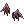 [Orelhas de Fafnir](https://www.divine-pride.net/database/item/18559/orelhas-de-fafnir) |   | 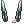 [Fones Amplificadores [1]](https://www.divine-pride.net/database/item/19241/fones-amplificadores-1)<br>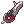 [Fones Danificados [1]](https://www.divine-pride.net/database/item/19245/fones-danificados-1)<br>Cartas:<br> [Carta Engkanto](https://www.divine-pride.net/database/item/4583/carta-engkanto) |
| Baixo |  [Máscara de Fafnir](https://www.divine-pride.net/database/item/18560/mascara-de-fafnir) |   |  [Competidor Lunático](https://www.divine-pride.net/database/item/420822/competidor-lunatico) |
| Armadura |  [Vestimenta dos Manuks [1]](https://www.divine-pride.net/database/item/15038/vestimenta-dos-manuks-1) |  [Carta Raposa Raivosa](https://www.divine-pride.net/database/item/27082/carta-raposa-raivosa) |   |
| Arma |  +7 [Katar de Cinzas [1]](https://www.divine-pride.net/database/item/28000/katar-de-cinzas-1) |  [Carta Mosca Caçadora](https://www.divine-pride.net/database/item/4115/carta-mosca-cacadora) | Armas:<br> [Gélida Ilusional [2]](https://www.divine-pride.net/database/item/610012/gelida-ilusional-2)<br> [Infiltrador Ilusional [2]](https://www.divine-pride.net/database/item/28022/infiltrador-ilusional-2)<br>Cartas:<br> [Carta Gan Ceann](https://www.divine-pride.net/database/item/300240/carta-gan-ceann)<br> [Carta Assassino Brutal](https://www.divine-pride.net/database/item/300241/carta-assassino-brutal)<br> [Carta Cavaleiro do Abismo](https://www.divine-pride.net/database/item/4140/carta-cavaleiro-do-abismo)|
| Capa | 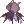 [Capuz dos Manuks](https://www.divine-pride.net/database/item/2577/capuz-dos-manuks) |   |   |
| Botas |  [Botas dos Manuks [1]](https://www.divine-pride.net/database/item/2477/botas-dos-manuks-1) |  [Carta Tritão Abismal](https://www.divine-pride.net/database/item/300144/carta-tritao-abismal) |   |
| Acessórios |  [Anel dos Manuks](https://www.divine-pride.net/database/item/2886/anel-dos-manuks)<br> [Anel Ilusional [1]](https://www.divine-pride.net/database/item/28509/anel-ilusional-1) |  [Carta Kobold](https://www.divine-pride.net/database/item/4091/carta-kobold) |  [Carta Aquecedor Ominoso](https://www.divine-pride.net/database/item/27116/carta-aquecedor-ominoso)<br> [Carta Scaraba Dourado](https://www.divine-pride.net/database/item/4508/carta-scaraba-dourado) |

<b>ATENÇÃO: Escolha o que for melhor pro seu bolso e pra sua realidade. Não fique preso aos itens comentados. Utilize todas as informações que este guia forneceu e tome suas próprias decisões.</b>

### Mid-game

Começamos a conseguir farmar algumas instâncias e ir atrás de alguns lucky drops mais valiosos

Objetivo do estágio: começar a resolver dano real. Aqui entram Espólio de Eremes, Ilusión A, módulos, Selo de Loki + Selo de Copas e cartas por tamanho/Chefe. Se o dano parecer baixo mesmo com ATQ, verifique bypass/ignorar DEF antes de comprar mais dano bruto.

Gargalos mais comuns: falta de bypass, carta errada, penalidade de arma e falta de pós-conjuração.

Não gaste muito com: mais ATQ ou dano de skill se o problema real for DEF, tamanho ou carta errada.

| Slot | Equips | Cartas | Alternativas |
| --- | --- | --- | --- |
| Topo | 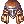 +11 [Espólio de Eremes [1]](https://www.divine-pride.net/database/item/400121/espolio-de-eremes-1) |  [Carta Louva-a-deus Angra](https://www.divine-pride.net/database/item/4513/carta-louva-a-deus-angra) |  [Chapéu Carnavalesco](https://www.divine-pride.net/database/item/401205/chapeu-carnavalesco-1) |
| Meio |  [Selo de Loki [1]](https://www.divine-pride.net/database/item/410233/selo-de-loki-1) |  [Carta Dramoh Rei](https://www.divine-pride.net/database/item/4524/carta-dramoh-rei) |  [Fones Amplificadores](https://www.divine-pride.net/database/item/19241/fones-amplificadores-1)<br> [Fones Danificados](https://www.divine-pride.net/database/item/19245/fones-danificados-1)<br> [Óculos de Segurança](https://www.divine-pride.net/database/item/410614/oculos-de-seguranca-1) |
| Baixo |  [Selo de Copas](https://www.divine-pride.net/database/item/420210/selo-de-copas) |   |  [Competidor Lunático](https://www.divine-pride.net/database/item/420822/competidor-lunatico) |
| Armadura | 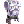+9 [Colete Ilusión A [1]](https://www.divine-pride.net/database/item/15376/colete-ilusion-a-1)<br>(2x [S-ATQ](https://www.divine-pride.net/database/item/29534/s-atq)) |  [Carta Raposa Raivosa](https://www.divine-pride.net/database/item/27082/carta-raposa-raivosa) |   |
| Arma |  +10 [Infiltrador Ilusional [1]](https://www.divine-pride.net/database/item/28022/infiltrador-ilusional-2) |  [Carta Alma de Eremes](https://www.divine-pride.net/database/item/4684/carta-alma-de-eremes) | Armas:<br> [Gélida Ilusional [1]](https://www.divine-pride.net/database/item/610012/gelida-ilusional-2)<br>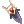 [Agudo Filo](https://www.divine-pride.net/database/item/28044/agudo-filo-2)<br>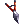 [Alicate](https://www.divine-pride.net/database/item/28045/alicate-2)<br>Cartas:<br> [Carta Gan Ceann](https://www.divine-pride.net/database/item/300240/carta-gan-ceann)<br> [Carta Assassino Brutal](https://www.divine-pride.net/database/item/300241/carta-assassino-brutal)<br> [Carta Cavaleiro do Abismo](https://www.divine-pride.net/database/item/4140/carta-cavaleiro-do-abismo)|
| Capa |  [Motor Ilusión A [1]](https://www.divine-pride.net/database/item/20933/motor-ilusion-a-1)<br>(2x  [S-CRIT](https://www.divine-pride.net/database/item/29539/s-crit) e  1x  [S-Rapidez](https://www.divine-pride.net/database/item/29537/s-rapidez)) |  [Carta Ninja Team](https://www.divine-pride.net/database/item/300732/carta-ninja-team) |   |
| Botas |  [Bota Temporal SOR [1]](https://www.divine-pride.net/database/item/22006/bota-temporal-sor-1)<br>([Espírito do Lutador 7](https://www.divine-pride.net/database/item/4822/espirito-do-lutador-7)<br>ou [Anti-Atraso 4](https://www.divine-pride.net/database/item/4881/anti-atraso-4)) |  [Carta Tritão Abismal](https://www.divine-pride.net/database/item/300144/carta-tritao-abismal) |   |
| Acessórios |  [Turbina Ilusión A [1]](https://www.divine-pride.net/database/item/32207/turbina-ilusion-a-1)<br>(1x [S-F4](https://www.divine-pride.net/database/item/25682/modulo-de-s-f4), 1x [S-AA4](https://www.divine-pride.net/database/item/25681/modulo-de-s-aa4))<br> [Luva de Sorte](https://www.divine-pride.net/database/item/2922/luva-de-sorte) |  [Carta Kobold](https://www.divine-pride.net/database/item/4091/carta-kobold) |  [Carta Aquecedor Ominoso](https://www.divine-pride.net/database/item/27116/carta-aquecedor-ominoso)<br> [Carta Scaraba Dourado](https://www.divine-pride.net/database/item/4508/carta-scaraba-dourado) |

<b>ATENÇÃO: Escolha o que for melhor pro seu bolso e pra sua realidade. Não fique preso aos itens comentados. Utilize todas as informações que este guia forneceu e tome suas próprias decisões.</b>

### Mid/End-game

Objetivo do estágio: trocar peças de transição por peças que resolvem gargalos específicos. Memorável Vingança dos Mortos com IT aumenta taxa crítica e dano das Retalhadoras; Cachecol + Brasão FOR resolve penalidade de arma; Manto Temporal AGI aumenta dano crítico e dano contra todos os tamanhos.

Gargalos mais comuns: penalidade de arma, multiplicadores saturados, pós-conjuração incompleta e troca de peças quebrando algum combo antigo.

| Slot | Equips | Cartas | Alternativas |
| --- | --- | --- | --- |
| Topo |  +10 [Memorável Vingança dos Mortos](https://www.divine-pride.net/database/item/18982/memoravel-vinganca-dos-mortos-1) |  [Carta Dramoh Abismal](https://www.divine-pride.net/database/item/300150/carta-dramoh-abismal) |  +11 [Espólio de Eremes](https://www.divine-pride.net/database/item/400121/espolio-de-eremes-1) |
| Meio |  [Selo de Loki [1]](https://www.divine-pride.net/database/item/410233/selo-de-loki-1) |  [Carta Dramoh Rei](https://www.divine-pride.net/database/item/4524/carta-dramoh-rei) |  [Asas Vitoriosas [1]](https://www.divine-pride.net/database/item/400002/asas-vitoriosas-1)<br>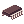 [Chip de Batalha [1]](https://www.divine-pride.net/database/item/410017/chip-de-batalha-1)<br> [Óculos de Segurança](https://www.divine-pride.net/database/item/410614/oculos-de-seguranca-1) |
| Baixo |  [Selo de Copas](https://www.divine-pride.net/database/item/420210/selo-de-copas) |   | 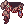 [Cachecol Físico de Schmidt](https://www.divine-pride.net/database/item/420748/cachecol-fisico-de-schmidt) |
| Armadura |  +9 [Colete Ilusión A](https://www.divine-pride.net/database/item/15376/colete-ilusion-a-1)<br>(2x [S-ATQ](https://www.divine-pride.net/database/item/29534/s-atq)) |  [Carta Raposa Raivosa](https://www.divine-pride.net/database/item/27082/carta-raposa-raivosa) |   |
| Arma |   +10 [Infiltrador Ilusional](https://www.divine-pride.net/database/item/28022/infiltrador-ilusional-2) |  [Carta Alma de Eremes](https://www.divine-pride.net/database/item/4684/carta-alma-de-eremes) | Armas:<br> [Gélida Ilusional](https://www.divine-pride.net/database/item/610012/gelida-ilusional-2)<br> [Agudo Filo](https://www.divine-pride.net/database/item/28044/agudo-filo-2)<br> [Alicate](https://www.divine-pride.net/database/item/28045/alicate-2)<br>Cartas:<br> [Carta Cavaleiro Branco](https://www.divine-pride.net/database/item/4608/carta-cavaleiro-branco) |
| Capa | 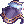 +11 [Manto Temporal AGI](https://www.divine-pride.net/database/item/20964/manto-temporal-agi-1) |  [Carta Ninja Team](https://www.divine-pride.net/database/item/300732/carta-ninja-team) |   |
| Botas |  [Bota Temporal SOR [1]](https://www.divine-pride.net/database/item/22006/bota-temporal-sor-1)<br>([Espírito do Lutador 7](https://www.divine-pride.net/database/item/4822/espirito-do-lutador-7)<br>ou [Anti-Atraso 4](https://www.divine-pride.net/database/item/4881/anti-atraso-4)) |  [Carta Tritão Abismal](https://www.divine-pride.net/database/item/300144/carta-tritao-abismal) |   |
| Acessórios |  [Turbina Ilusión A](https://www.divine-pride.net/database/item/32207/turbina-ilusion-a-1)<br>(1x [S-F4](https://www.divine-pride.net/database/item/25682/modulo-de-s-f4), 1x [S-AA4](https://www.divine-pride.net/database/item/25681/modulo-de-s-aa4))<br>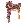 [Brasão de Schmidt FOR](https://www.divine-pride.net/database/item/32228/brasao-de-schmidt-for-1)<br>([Pedra de Crítico 4](https://www.divine-pride.net/database/item/4843/pedra-de-critico-4) ) |  [Carta Aquecedor Ominoso](https://www.divine-pride.net/database/item/27116/carta-aquecedor-ominoso) |  [Carta Mímico do Vazio](https://www.divine-pride.net/database/item/300278/carta-mimico-do-vazio) |

<b>Observações:</b>
Caso ainda não tenha um pet Abelha-Rainha com lealdade Alta ou Manopla do Infinito, continue usando o  [Brasão de Schmidt FOR [1]](https://www.divine-pride.net/database/item/32228/brasao-de-schmidt-for-1) com o  [Cachecol Físico de Schmidt](https://www.divine-pride.net/database/item/420748/cachecol-fisico-de-schmidt). Deixe a FOR base 125 pra ativar o combo que anula a penalidade de arma da arma.

<b>ATENÇÃO: Escolha o que for melhor pro seu bolso e pra sua realidade. Não fique preso aos itens comentados. Utilize todas as informações que este guia forneceu e tome suas próprias decisões.</b>

### O Começo do Fim (Início do End-game)

Eu vou deixar apenas o começo do end-game. Nesse estágio, você já deve ser capaz de solar todo o conteúdo até o episódio 17.2. A partir daqui o céu é o limite, e os upgrades começam a ficar bem mais caros.

Objetivo do estágio: nesse ponto, você já deve ter resolvido os gargalos da classe, ou deveria ter resolvido kk, então o foco é TOPAR dano. A partir daqui, cada upgrade deve ser pensado, já que começa a ficar muito caro.

Gargalos mais comuns: custo-benefício ruim, encantamento caro demais e multiplicador saturado.

Não gaste muito com: perfeccionismo. Se o upgrade custa muito e resolve pouco, evite.

<b>OBS.:</b> não vou postar um exemplo pronto de build High End-game no momento. A ideia é dar um norte pra quem está começando. Se você já passou dessa etapa, acredito que já deve conhecer bastante do jogo e não precisa desse guia #paz

| Slot | Equips | Cartas | Alternativas |
| --- | --- | --- | --- |
| Topo |  +12  [Memorável Vingança dos Mortos](https://www.divine-pride.net/database/item/18982/memoravel-vinganca-dos-mortos-1)<br>([Insígnia do Talento 5](https://www.divine-pride.net/database/item/29085/insignia-do-talento-5) ) |  [Carta Dramoh Abismal](https://www.divine-pride.net/database/item/300150/carta-dramoh-abismal) |  +11 [Espólio de Eremes](https://www.divine-pride.net/database/item/400121/espolio-de-eremes-1) |
| Meio |  [Selo de Loki [1]](https://www.divine-pride.net/database/item/410233/selo-de-loki-1) |  [Carta Dramoh Rei](https://www.divine-pride.net/database/item/4524/carta-dramoh-rei) |   |
| Baixo |  [Selo de Copas](https://www.divine-pride.net/database/item/420210/selo-de-copas) |   |  [Cachecol Físico de Schmidt](https://www.divine-pride.net/database/item/420748/cachecol-fisico-de-schmidt) |
| Armadura | 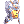+11 [Colete Automatron A](https://www.divine-pride.net/database/item/450127/colete-automatron-a-1)<br>(2x [M-ATQ](https://www.divine-pride.net/database/item/310099/m-atq) ) |  [Carta Raposa Raivosa](https://www.divine-pride.net/database/item/27082/carta-raposa-raivosa) |  [Carta Abrigo](https://www.divine-pride.net/database/item/4393/carta-abrigo) |
| Arma |  +11 [Katar Primordial](https://www.divine-pride.net/database/item/610008/katar-primordial-2) |  [Carta Alma de Eremes](https://www.divine-pride.net/database/item/4684/carta-alma-de-eremes) | Armas:<br> [Jur Primordial](https://www.divine-pride.net/database/item/610009/jur-primordial-2)<br>Cartas:<br> [Carta Andarilho Poluto](https://www.divine-pride.net/database/item/27361/carta-andarilho-poluto) |
| Capa |  +12 [Manto Temporal AGI](https://www.divine-pride.net/database/item/20964/manto-temporal-agi-1) |  [Carta Ninja Team](https://www.divine-pride.net/database/item/300732/carta-ninja-team) |  [Carta Alegria](https://www.divine-pride.net/database/item/300271/carta-alegria) |
| Botas |  [Bota Temporal SOR [1]](https://www.divine-pride.net/database/item/22006/bota-temporal-sor-1)<br>([Espírito do Lutador 7](https://www.divine-pride.net/database/item/4822/espirito-do-lutador-7)<br>ou [Anti-Atraso 4](https://www.divine-pride.net/database/item/4881/anti-atraso-4)) |  [Carta Tritão Abismal](https://www.divine-pride.net/database/item/300144/carta-tritao-abismal) |   |
| Acessórios |  [Turbina Ilusión A](https://www.divine-pride.net/database/item/32207/turbina-ilusion-a-1)<br>(1x [S-F4](https://www.divine-pride.net/database/item/25682/modulo-de-s-f4), 1x [S-AA4](https://www.divine-pride.net/database/item/25681/modulo-de-s-aa4))<br> [Brasão de Schmidt FOR](https://www.divine-pride.net/database/item/32228/brasao-de-schmidt-for-1)<br>([Pedra de Crítico 4](https://www.divine-pride.net/database/item/4843/pedra-de-critico-4) ou  [Fatal 2](https://www.divine-pride.net/database/item/4864/fatal-2)) |  [Carta Mímico do Vazio](https://www.divine-pride.net/database/item/300278/carta-mimico-do-vazio) |  [Anulus Ira](https://www.divine-pride.net/database/item/491014/anulus-ira-1) |

<b>Observações:</b>
Aqui é importante saber sobre a build que você deseja seguir, se vai ser uma build de Lâminas Retalhadoras ou uma build mais focada nas skills de 4 classe. 

Caso opte pela build de Retalhadoras, você pode escolher entre duas opções:
* Um Colete Automatron A com um automódulo [P-Bárbaro](https://www.divine-pride.net/database/item/310106/p-barbaro)  e 2x [M-ATQ](https://www.divine-pride.net/database/item/310099/m-atq) (um [H-Lâminas](https://www.divine-pride.net/database/item/310139/h-laminas) no lugar do [P-Bárbaro](https://www.divine-pride.net/database/item/310106/p-barbaro) ajuda, é mais barato mas a longo prazo vai cair de rendimento)
* Ou um [Traje do Lobo Cinzento](https://www.divine-pride.net/database/item/450177/traje-do-lobo-cinzento-1) com o encanto [Orbe Lupino - Lâminas](https://www.divine-pride.net/database/item/310528/). Se possível, pegue no slot 4 ou 3 o encantamento Orbe Lupino - [Bárbaro 1](https://www.divine-pride.net/database/item/310503/), [Bárbaro 2](https://www.divine-pride.net/database/item/310506/) ou [Bárbaro 3](https://www.divine-pride.net/database/item/310509/), mas não corra atrás do encantamento perfeito. Caso consiga 1 deles, já está ótimo.

Caso opte por uma build mais voltada pras skills de 4ª classe, você também vai ter 2 opções:
* Um Colete Automatron A com um [P-Bárbaro](https://www.divine-pride.net/database/item/310106/p-barbaro) e 2x [M-ATQ](https://www.divine-pride.net/database/item/310099/m-atq). 
* Ou um [Traje do Lobo Cinzento](https://www.divine-pride.net/database/item/450177/traje-do-lobo-cinzento-1) com o encanto [Orbe Lupino - Gemini](https://www.divine-pride.net/database/item/310542/). Se possível, pegue no slot 4 ou 3 o encantamento Orbe Lupino - [Bárbaro 1](https://www.divine-pride.net/database/item/310503/), [Bárbaro 2](https://www.divine-pride.net/database/item/310506/) ou [Bárbaro 3](https://www.divine-pride.net/database/item/310509/), mas não corra atrás do encantamento perfeito. Caso consiga 1 deles, já está ótimo.

| Opção | Por quê | Encanto|
| --- | --- | --- |
| [Bota Temporal SOR [1]](https://www.divine-pride.net/database/item/22006/bota-temporal-sor-1)|Continua relevante pelo ATQ, mas pode sair quando as Botas Primordiais ativarem o combo do Broche Primordial.|Delírio/Ânimo|
| [Brasão de Schmidt FOR [1]](https://www.divine-pride.net/database/item/32228/brasao-de-schmidt-for-1)|Mantém valor enquanto a penalidade de arma for um problema importante da build.|Lucidez/Desânimo|
| [Brasão de Schmidt SOR [1]](https://www.divine-pride.net/database/item/32230/brasao-de-schmidt-sor-1)|Alternativa se você já montou atributos e cartas em torno de SOR/CRIT.|Lucidez/Desânimo|
| [Diadema Radiante [1]](https://www.divine-pride.net/database/item/410183/diadema-radiante-1) <br> [Anel Radiante Rubi [1]](https://www.divine-pride.net/database/item/490056/anel-radiante-rubi-1) <br> [Colar Radiante Rubi [1]](https://www.divine-pride.net/database/item/490057/colar-radiante-rubi-1)<br> [Carta Dolorian](https://www.divine-pride.net/database/item/300250/carta-dolorian)<br>| Combo situacional. É MUITO forte, mas só pra monstros ou MVPs Anjos e principalmente Demônios. | Empatia ou Abrigo<br>com Bondade |

<b>ATENÇÃO: Escolha o que for melhor pro seu bolso e pra sua realidade. Não fique preso aos itens comentados. Utilize todas as informações que este guia forneceu e tome suas próprias decisões.</b>

## Rota de Up

### Visão Geral

Dica: se não tiver grana, vire um lixeiro e pegue tudo do chão pra pagar as EDPs.

| Nível | Mapa | Elemento recomendado | Drops valiosos | Observação |
| --- | --- | --- | --- | --- |
| 99 ~ 110 | Quest do Éden | -- | Nenhum | Particularmente, eu gosto de upar nessa faixa de level nas quests do Éden. Com 2x Exp, 1 rotação é suficiente. |
| 110 ~ 120 | Quest do Éden | -- | Nenhum | Particularmente, eu gosto de upar nessa faixa de level nas quests do Éden. Com 2x Exp, 1 rotação é suficiente. |
| 120 ~ 130 | Quest do Éden/Tatacho | Fogo (Tatacho) | Nenhum | Particularmente, eu gosto de upar nessa faixa de level nas quests do Éden. Com 2x Exp, 1 rotação é suficiente.<br>Pode ir pros Tatachos também, mas eu não gosto de upar lá. |
| 130 ~ 140 | Quest do Éden/Basilisco | Fogo (Basilisco) | Nenhum | Particularmente, eu gosto de upar nessa faixa de level nas quests do Éden. Com 2x Exp, 1 rotação é suficiente.<br>Pode ir pros Basiliscos também, mas eu não gosto de upar lá. |
| 140 ~ 150 | Ilusão do Mar | Vento | Gélida Ilusional, Tritão Abismal, Fruto de Yggdrasil e Gelo Místico | Esse mapa faz você upar MUITO rápido. A quest diária também dá muita Exp. Provavelmente você vai precisar começar a usar EDP nesse momento. |
| 150 ~ 160 | Ilusão da Tartaruga 1 | Fogo | Galho Místico, Runa Bruta, Geleia Real | Pode upar solo ou em grupo, caso tenha algum. Os mobs têm bastante defesa, então ter um pouco de penetração de armadura vai ser necessário. A partir desse mapa, o uso de EDP vai ser necessário. |
| 150 ~ 160 | Ilusão do Ursinho | Neutro | Carta Ursinhos Coloridos e Carta Fragmento de Alma | Esse mapa é bem melhor que a Ilusão da Tartaruga, mas também é bem mais difícil. |
| 160 ~ 170 | Ilusão das Formigas | Fogo | Malha Corredor Ilusional, Bota Corredor Ilusional, Anel Corredor Ilusional e Espinho Ilusional | Os mobs aqui batem bem então cuidado. |
| 160 ~ 170 | Ilusão de Luanda | Fogo | Nada | Particularmente eu não gosto desse mapa porque sinto que tem muito pouco mob mas caso a Ilusão da Formiga esteja muito lotada ou não aguente upar lá, esse mapa pode ser uma boa opção. |
| 170 ~ 180 | Ilusão do Labirinto | Fogo | Carta Bafinho Caótico, Carta Mantis Caótico | Esse mapa é horrível e superlotado, mas não tem jeito. Aguente um pouco até o 175 e vá pra Caverna de Magma 3. |
| 175 ~ 180 | Caverna de Magma 3 | Neutro | Equips | Mapa tranquilo. Pode pegar os equips do chão, que vão dar uma graninha e pagar as EDPs. |
| 180 ~ 187 | Minas | Fogo | Minérios (Vermium, Bramium etc.) | Aqui o gap de vida dos mobs começa a aumentar muito; cada mob tem 3.3kk +-, mas o lado bom é que a EXP voa. |
| 187 ~ 192 | Templo de Odin 3 | Sombrio | Pedra do Sábio | Não esqueça de usar Pergaminho de Armadura Sagrada. |
| 190 ~ 200 | Abyss 4  | Fogo | Arca do Tesouro | Não esqueça de usar Pergaminho de Armadura Sombria. |
| 190 ~ 200 | Torre de Thanatos 10, 11, 12 | Terra | Carta Mímico do Vazio, Carta Alegria, Carta Empatia | Se você não tiver MUITO forte, nem chega perto desse mapa. |
| 190 ~ 200 | Torre de Thanatos 12 | Água | Diamante de 2 e 3 quilates | Ainda pior que a Torre de Thanatos 10 e 11. Aqui os mobs quebram o Hat muito fácil. |
| 200 ~ 215 | Niff 1 | Neutro/Fogo | Armas, Pó de Éter, Carta Assassino Brutal e Carta Gan Ceann | Os mobs batem bem e o mapa é cheio de mobs. Tenha bons equips pra não passar sufoco. Procure PT. |
| 200 ~ 215 | Rudus 4 | Fogo | Armas, Pó de Éter, Carta Dolorian | Mapa muito tranquilo. Particularmente eu gosto de ficar aqui farmando Pó de Éter e upar ao mesmo tempo. Pegue tudo do chão porque vai dar uma grana legal. |
| 215 ~ 230 | Amicitia 1 | Veneno | Armas e Pó de Éter | Aqui começa a ficar bem mais difícil o up. Dá pra farmar uns KKs legais aqui, mas tome cuidado pra não mobar muito, porque senão você vai de Vasco. |
| 230 ~ 240 | Amicitia 2 | Veneno | Armas, Pó de Éter, Carta Quimera Galensis | Mesma coisa que Amicitia 1, só que pior. Provavelmente você não vai aguentar upar até o 240, então, se quiser só pegar job 50 e parar de upar, está ótimo. Recomendo ficar até o level 235 no máximo. |
| 240 ~ 250 | Niff 2 | Neutro/Fogo | Armas e Pó de Éter | Se você aguentou upar até aqui, você vai desistir de terminar de upar agora kkkk. |

## Dicas de Farm

### Visão Geral

Quem não pota não dropa. Não economize nos consumíveis necessários e EDP.

### Rotação de Instâncias

Monte uma rotação por tempo de recarga e por tipo de alvo. Pra cada instância, anote:

| Instância | Tamanho | Raça | Elemento Recomendado | Carta recomendada | Drop que paga a run |
| --- | --- | --- | --- | --- | --- |
| EDDA Biolab | Médio | Humanoide | Veneno | Cartas de tamanho, Cavaleiro do Abismo ou Alma de Eremes | Carta Cientista, Caixa de Armas Ancestrais e Bioarmas |
| EDDA Glast Heim | Médio | Veneno | A definir | Carta Pere cantante, cartas de tamanho, Cavaleiro do Abismo ou Alma de Eremes | Carta Cavaleiro Branco, Carta Cavaleira Khalitzburg, Mantos Temporais |
| Fábrica do Terror | Grande | Morto-Vivo | Fogo/Terra/Água/Vento ou Veneno+Potencializar Veneno | Cartas de tamanho, Cavaleiro do Abismo ou Alma de Eremes | Carta Celine Kime, Velho Álbum de Cartas e Álbum Mágico de Cartas |


### Lucky Drops

Olhe o Alt+Q das pessoas. Veja as cartas que elas usam e vá atrás de dropar pra vender.

## Considerações finais

Esse guia não é uma receita de bolo. A ideia aqui não é você copiar exatamente cada item e achar que a build só funciona de um jeito. Ragnarok é um jogo cheio de detalhe, preços voláteis, eventos que mudam tudo e item que às vezes aparece barato do nada (ofertas da shopee).

Use o guia como um norte. Antes de comprar qualquer coisa cara, tenta entender qual problema aquele item resolve.

Sicário/Executor de Katar é uma classe muito gostosa de jogar quando a build encaixa. Você vai sentir cada upgrade melhorando seu char.

No fim, a melhor build é a que cabe no seu bolso, resolve seus gargalos e te deixa farmar sem passar raiva. Se você entendeu isso, já está no caminho certo. Agora é juntar zeny, testar as coisas e parar de achar que todo problema se resolve comprando o item mais caro do market kk.

